<!-- Typing -->

  

## 👋 Hello, I’m Sabin Sapkota

I’m a **Machine Learning & Data Science practitioner** with a strong foundation in Python, data analysis, and model building. I love turning real-world problems into data-driven solutions using statistical thinking and ML techniques.

🔭 **I’m currently working on:** building predictive ML models and exploring real-world datasets to improve decision-making.

🌱 **I’m currently learning:** Deep Learning (neural networks, CNNs, RNNs, transformers) and advanced model deployment.

👯 **I’m looking to collaborate on:** data science projects, ML research, and AI-based applications that create real impact.

🤝 **I’m looking for help with:** scaling ML models, optimizing training pipelines, and improving model performance with best practices.

⚡ Fun fact: I’m a self-taught learner who loves solving puzzles and mastering new algorithms — and I drink way too much milk!

---

  

---

## 📊 GitHub Stats

---

<!-- BOTTOM GRADIENT -->

  

